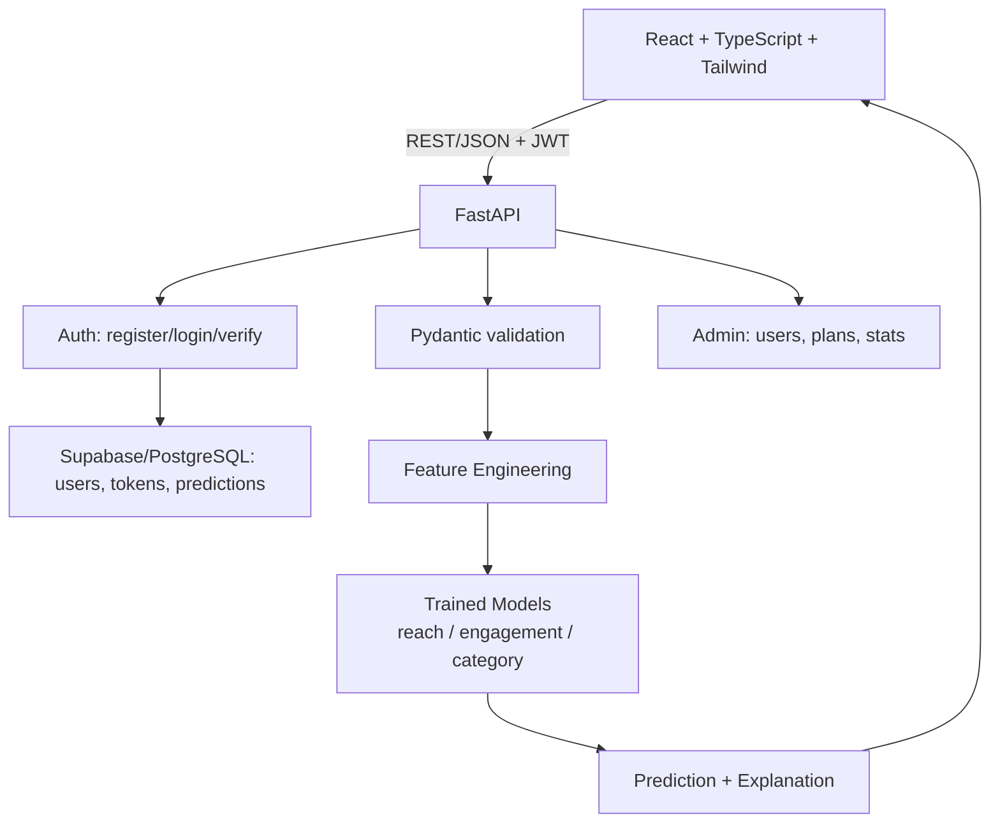

# PostPulse — Content Performance Predictor

Post before you post. **PostPulse** is a full-stack ML web app that predicts how
an Instagram post will perform — *before* you hit publish.

Type in a post idea (format, caption, hashtags, posting time), and PostPulse
returns a **0–100 performance score**, expected reach, expected engagement
rate, the factors driving the prediction, and — uniquely — **specific,
actionable recommendations**: the best day and time to post, the ideal caption
length, and the right number of hashtags. No generic guru advice: it literally
re-runs the trained model on tweaked versions of *your* post and only reports
the changes it predicts will lift reach.

<div align="center">

**🚀 Live demo — frontend:** *your Vercel URL here*
**🔌 Live API:** [`https://postpulse-api-ksm5.onrender.com`](https://postpulse-api-ksm5.onrender.com) · interactive docs at `/docs`
**📊 Try it:** register → verify → predict

</div>

A portfolio project demonstrating a complete, honest ML pipeline: real data
validation, model comparison, evaluation, explainability, authentication, and
production architecture (FastAPI + PostgreSQL/Supabase + React).

---

## One-Minute Overview

| | |
|---|---|
| 🤖 **AI part** | Gradient-boosted models predict reach, engagement rate, and performance category — offline-trained, served from a Joblib bundle |
| 🧠 **Recommendations** | Sweeps 168 day×time slots, 10 caption lengths, 11 hashtag counts through the model to recommend what actually moves the needle |
| 🧪 **Honesty** | The training data is synthetic and *documented as such*; a real Kaggle dataset that had zero signal was caught and rejected |
| 🛡️ **Security** | bcrypt hashing, JWT auth, email verification, admin module |
| 🏗️ **Architecture** | FastAPI backend on Render + React frontend on Vercel + Supabase PostgreSQL |

---

## Table of Contents

1. [Architecture](#architecture)
2. [Tech Stack](#tech-stack)
3. [Dataset & Model](#dataset--model)
4. [The Kaggle Dataset Case Study](#the-kaggle-dataset-case-study)
5. [Feature Engineering](#feature-engineering)
6. [Models & Evaluation](#models--evaluation)
7. [Explainability](#explainability)
8. [Recommendation Engine](#recommendation-engine)
9. [Authentication & Admin](#authentication--admin)
10. [API Reference](#api-reference)
11. [Running Locally](#running-locally)
12. [Email Verification](#email-verification)
13. [Production Deployment](#production-deployment)
14. [Testing](#testing)
15. [Limitations](#limitations)
16. [Roadmap](#roadmap)

---

## Architecture



The model is **trained offline** (`ml/src/train.py`) and served from a Joblib
bundle loaded once at API startup — never retrained on a request.

## Tech Stack

| Layer | Technology |
|---|---|
| Frontend | React 18, TypeScript, Vite, Tailwind CSS, Recharts, Axios, React Router |
| Backend | FastAPI, Pydantic, Uvicorn, SQLAlchemy |
| Auth | bcrypt password hashing, JWT (PyJWT), SMTP/API email verification |
| ML | Python, NumPy, Pandas, Scikit-learn, Matplotlib, Seaborn, Joblib |
| Database | **PostgreSQL via Supabase** (prod + local); SQLite auto-fallback for zero-setup local dev |
| Deploy | Render (API) · Vercel (web) · Supabase (DB) |

## Dataset & Model

PostPulse ships with a **synthetic training dataset** (`ml/src/generate_dataset.py`)
built so the product actually predicts *something real* — with documented
relationships baked in between inputs and outcomes:

- Historical engagement/reach carry over to future posts (a latent "creator skill")
- **Evening posting (6–9 PM) outperforms; late night (1–5 AM) underperforms**
- **Captions around 90–160 characters outperform** very short or very long ones
- **Hashtags help up to ~8, then show diminishing/negative returns**
- Followers scale with reach **sub-linearly** (log relationship)
- Reels outperform static images; a call-to-action lifts engagement
- Injected noise keeps the relationships from being trivially perfect

15,030 rows, generated deterministically (`np.random.default_rng(42)`) — 15,000
unique + 30 duplicates + 1% missingness in `account_age_months`, mirroring the
imperfections of a real logged dataset.

**Unlike a purely random dataset, this one has learnable structure** — and the
models below prove they found it. The synthetic nature is disclosed on purpose:
honesty about training data is part of the point.

## The Kaggle Dataset Case Study

Early on, a **real Kaggle dataset** (`Instagram_Analytics.csv`, 29,999 posts
across 20 accounts) was integrated — but only after being validated. That
validation found:

- The **highest correlation** between any input feature and any outcome was **0.011**
- The classifier's ROC-AUC was **0.500** — *exactly chance*

The dataset's outcome columns turned out to be generated independently of its
inputs. Rather than ship a model that *looked* sophisticated but had no real
power, the finding was reported honestly and the project moved to the signal-rich
synthetic dataset above.

> Why this matters: **catching a dataset with no learnable signal before
> building on top of it is itself a real ML engineering skill.** The adapter
> (`ml/src/load_instagram_dataset.py`) and full validation methodology remain
> in the repo as a demonstration of that process.

## Feature Engineering

Implemented once in `ml/src/feature_engineering.py`, imported by both training
and inference code to guarantee train/serve consistency.

| Feature | Rationale |
|---|---|
| `description_length_category` | Quantile-based caption-length buckets |
| `posting_hour_category` | Groups raw hour into interpretable buckets |
| `is_weekend` | Weekend vs. weekday posting |
| `hashtag_density` | Hashtags per 100 characters of caption |
| `historical_engagement_score` | Blends historical reach (log-scaled) and engagement rate |
| `creator_experience_score` | Combines account age and follower scale (log-log) |
| `follower_normalized_performance` | Reach per follower — efficiency, not just scale |

Inputs: `content_type` (reel/image/carousel), `creator_category`, `account_type`
(brand/creator), `has_call_to_action`, `description_length`, `hashtags`,
`followers`, `account_age_months`, `historical_avg_views`,
`historical_engagement_rate`, `posting_hour`, `day_of_week`.

**No post-publication metric is ever used as an input** — only pre-publication
content, account, and timing information.

## Models & Evaluation

### Expected Reach (regression)

| Model | MAE | RMSE | R² |
|---|---|---|---|
| Baseline (mean) | 6,788 | 23,316 | -0.050 |
| Unconstrained linear models | 4,767–5,104 | 38,332–51,889 | excluded ⚠️ |
| HistGradientBoosting (tuned) | 2,097 | 10,663 | 0.780 (val) |
| **Gradient Boosting ✅** | **2,011** | **8,425** | **0.863 (val)** |

Linear models are excluded **on principle**, not just on loss: with a `log1p`
target and one-hot categoricals, unconstrained linear regression extrapolates
to astronomical predictions on out-of-distribution rows — a reproduced finding
from earlier in this project.

**Held-out test:** MAE = 3,082 · RMSE = 58,898 · R² = **0.458**. Test R² trails
validation R² because a few high-reach outliers land in the test split of this
heavy-tailed target — MAE, the headline metric, stays >2× better than baseline
either way.

### Expected Engagement Rate (regression)

| Model | MAE | RMSE | R² |
|---|---|---|---|
| Baseline (mean) | 1.45 | 1.80 | -0.001 |
| Linear Regression / Ridge | 0.80 | 1.00 | 0.690 |
| **Gradient Boosting ✅** | **0.79** | **0.98** | **0.701** |

**Held-out test:** MAE = 0.80 · RMSE = 1.00 · R² = **0.684**

### Performance Category (classification)

| Model | Accuracy | F1 (macro) | ROC-AUC (OvR) |
|---|---|---|---|
| Baseline (class prior) | 0.459 | 0.210 | 0.500 |
| Decision Tree | 0.751 | 0.752 | 0.884 |
| Random Forest | 0.793 | 0.795 | 0.923 |
| **Gradient Boosting ✅** | **0.794** | **0.795** | **0.927** |

**Held-out test:** Accuracy = 0.775 · F1 (macro) = 0.775 · ROC-AUC = **0.922**

Confusion matrix (test set, rows = actual, columns = predicted):

```
             Pred Low  Pred Medium  Pred High
Actual Low        788          186          0
Actual Medium     197         1072        109
Actual High         1          183        464
```

Errors cluster on **adjacent** classes (Low↔Medium, Medium↔High); the model
essentially never confuses Low with High directly.

## Explainability

Permutation importance (`sklearn.inspection.permutation_importance`, 8 repeats)
on the held-out test set. Top drivers:

- **Historical engagement score — 21.1%**
- **Historical average reach — 19.4%**
- Posting hour — 3.8%
- Content format & follower count — ~0.6–0.7% each

Disclosed honestly: this is a documented approximation of local feature
contribution (global importance + row-specific description), **not** true
SHAP/Shapley values.

## Recommendation Engine

Beyond headline predictions, every response includes a **model-driven
recommendation engine** (`ml/src/predict.py`) that suggests concrete, specific
changes — not generic advice. Instead of hard-coded "best practices," it
**re-runs the trained views model on candidate modifications** of the user's
exact input and reports only the changes the model actually predicts will raise
reach, ranked by real impact.

| Analysis | What it does |
|---|---|
| **Posting schedule** | Sweeps all **7 days × 24 hours = 168 combinations** through the model to find the single best day, best hour, and best combined slot — plus ranked alternatives so you can see *why*. |
| **Caption strategy** | Tests **10 candidate caption lengths** (40–300 chars) to find the length that maximizes reach for *this specific post*. |
| **Hashtag strategy** | Tests **11 candidate hashtag counts** (2–20) to find the sweet spot, avoiding under- and over-tagging extremes. |

A `quick_tips` list then ranks the biggest wins (e.g. reel → +X views, add a
CTA, adopt the optimal caption/hashtag/schedule) so users see at a glance which
single edit moves the needle most. If the model predicts no content tweak
helps, the app says so honestly — it **never fabricates advice** the model
doesn't back.

The structured analysis is returned in the payload (`posting_schedule`,
`caption_strategy`, `hashtag_strategy`) and rendered as dedicated cards on the
results page.

## Authentication & Admin

- **Registration** requires email + password (min. 8 chars); accounts start unverified.
- **Email verification is required before predictions** (unverified `/predict`
  returns 403). Without SMTP configured, verification links print to the
  backend console — fully usable with zero email setup.
- **Login** issues a JWT (7-day expiry) used as a Bearer token on protected routes.
- **Admin bootstrap:** set `ADMIN_BOOTSTRAP_EMAIL` in `backend/.env` before
  first registering that address — that account auto-promotes to admin. No
  manual DB editing required.
- **Admin module** (`/api/admin/*`): list users, toggle admin, change a user's
  `plan` (`free`/`pro`), view aggregate stats.
- Prediction history is scoped per-user — you only ever see your own past
  predictions.

## API Reference

**Base URL:** `http://localhost:8000/api` · **Interactive docs:** `http://localhost:8000/docs`

| Method | Endpoint | Auth | Description |
|---|---|---|---|
| GET | `/health` | none | Liveness check |
| POST | `/auth/register` | none | Create account + send verification email |
| GET | `/auth/verify-email?token=` | none | Verify email from link |
| POST | `/auth/login` | none | Returns JWT + user |
| GET | `/auth/me` | JWT | Current user |
| POST | `/auth/resend-verification` | none (email+password) | Resend verification email |
| POST | `/predict` | JWT, verified | Single prediction (score, reach, engagement, factors, recommendations) |
| POST | `/predict/batch` | JWT, verified | Batch predictions |
| GET | `/model-info` | none | Model metadata, test metrics, feature importance |
| GET | `/prediction-history` | JWT, verified | Current user's past predictions |
| GET | `/prediction-history/{id}` | JWT, verified | One past prediction's full detail |
| GET | `/admin/users` | JWT, admin | List all users |
| PATCH | `/admin/users/{id}` | JWT, admin | Update admin/plan/verified status |
| GET | `/admin/stats` | JWT, admin | Aggregate usage stats |

## Running Locally

### 1. Connect a database

Use your **Supabase** connection string — the app auto-creates its tables on
startup:

```bash
cd backend
cp .env.example .env
# Edit .env: set DATABASE_URL to your Supabase connection string,
# ADMIN_BOOTSTRAP_EMAIL to your email, and a real SECRET_KEY
```

No database handy? Leave `DATABASE_URL` unset and the app falls back to a local
SQLite file automatically — everything else works the same.

### 2. Train the model

```bash
pip install -r ml/requirements.txt
python ml/src/generate_dataset.py
python ml/src/train.py
```

### 3. Run the backend

```bash
cd backend
pip install -r requirements.txt
python -m uvicorn app.main:app --reload --port 8000
```

API docs at `http://localhost:8000/docs`. On Windows, if `uvicorn` isn't on your
PATH, use `python -m uvicorn ...` as shown above.

### 4. Run the frontend

```bash
cd frontend
npm install
npm run dev
```

App at `http://localhost:5173`. Register an account with the email you set as
`ADMIN_BOOTSTRAP_EMAIL` to get admin access.

## Email Verification

Verification links are emailed by default. **Never put your real Google
password in `.env`** — for Gmail, generate a dedicated **App Password**:

1. Enable **2-Step Verification** on the Google account (required for App Passwords)
2. Go to [myaccount.google.com/apppasswords](https://myaccount.google.com/apppasswords)
3. Generate a 16-character app password
4. Set in `backend/.env`:
   ```
   EMAIL_HOST=smtp.gmail.com
   EMAIL_PORT=587
   EMAIL_USER=youraddress@gmail.com
   EMAIL_APP_PASSWORD=the16charapppassword
   ```

Leave these blank and verification links print to the backend console instead —
no email setup required to run and test locally.

## Production Deployment

**There is a dedicated step-by-step guide: [`DEPLOYMENT.md`](DEPLOYMENT.md)** —
the exact setup this project ships pre-configured for: **Render** (FastAPI +
PostgreSQL) and **Vercel** (React). It covers the `render.yaml` Blueprint,
`frontend/vercel.json` SPA routing, and the full env-var checklist.

Key conventions:

- The backend is **self-contained** — `app/ml/` bundles the inference code and
  the model bundle lives in `backend/models/`, so it deploys standalone without
  the `ml/` training tree.
- `DATABASE_URL` also works as `postgres://...` — both are normalized
  automatically to `postgresql+psycopg2://...`.

### Production environment variables

See `DEPLOYMENT.md` for the full table. The key ones:

| Variable | Required | Notes |
|---|---|---|
| `DATABASE_URL` | Yes | `postgresql+psycopg2://...` (Supabase). `postgres://`/`postgresql://` auto-normalized. |
| `SECRET_KEY` | Yes | `python -c "import secrets; print(secrets.token_hex(32))"` — never reuse the dev default |
| `ALLOWED_ORIGINS` | Yes | Your deployed frontend's exact URL(s), comma-separated |
| `ADMIN_BOOTSTRAP_EMAIL` | Recommended | Set before first registering that address |
| `EMAIL_HOST`/`EMAIL_USER`/`EMAIL_APP_PASSWORD` | Recommended | Without these, links only print to server logs — fine for testing |
| `FRONTEND_URL` | Yes (if emailing) | Base URL used to build verification links |
| `VITE_API_URL` (frontend build-time) | Yes | Your deployed backend's `/api` URL |

Run the backend without `--reload` in production, with multiple workers:

```bash
uvicorn app.main:app --host 0.0.0.0 --port 8000 --workers 4
```

## Testing

- **ML pipeline:** `python ml/src/predict.py` runs a sample prediction end-to-end.
- **Auth + API flow** (tested live during development):
  ```bash
  curl -X POST http://localhost:8000/api/auth/register -H "Content-Type: application/json" \
    -d '{"email":"you@example.com","password":"yourpassword123"}'
  # check backend console for the verification link (dev mode) or your inbox
  curl "http://localhost:8000/api/auth/verify-email?token=<token>"
  curl -X POST http://localhost:8000/api/auth/login -H "Content-Type: application/json" \
    -d '{"email":"you@example.com","password":"yourpassword123"}'
  # use the returned access_token as: -H "Authorization: Bearer <token>"
  ```
- **Frontend:** `npm run build` type-checks (`tsc -b`) and produces a
  production bundle in `frontend/dist/`.

## Limitations

Honest about boundaries, by design:

- **Training data is synthetic.** It's built to have real, learnable
  relationships (unlike the rejected Kaggle dataset), but absolute metrics
  describe fit to this generative process, not guaranteed accuracy on real
  Instagram data.
- **No payment integration yet.** The `plan` field and admin controls are the
  foundation for monetization, not a working paywall.
- **JWTs aren't revocable** before their 7-day expiry — no server-side
  blocklist. Fine for a portfolio project, not for a security-sensitive
  production deployment.
- **Local explanations are an approximation**, not true SHAP/Shapley attribution.
- **No rate limiting, CSRF protection, or refresh-token rotation** — deliberately
  out of scope (memo: an in-memory rate limiter is useless across multiple
  workers; a correct one needs a shared store like Redis).

## Roadmap

- Stripe integration to turn `plan` into a real paywall
- Retrain on licensed real Instagram data, applying the same correlation-based
  validation used on the Kaggle case study
- Refresh tokens + token revocation/blocklist
- Rate limiting on auth endpoints
- SHAP for genuine per-prediction local attribution
- Batch CSV upload for creators managing multiple posts
- Password reset flow