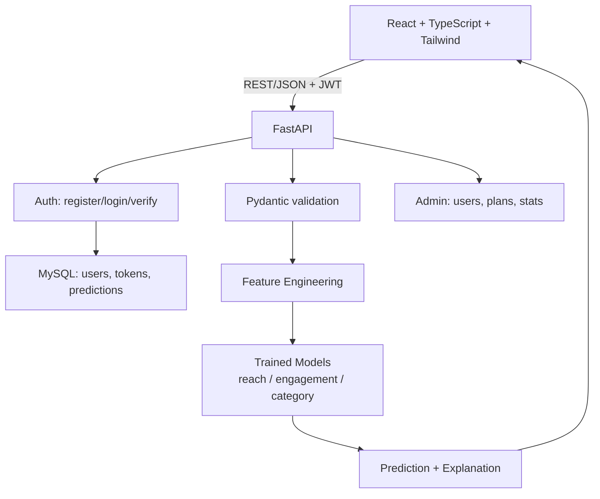

# PostPulse — Content Performance Predictor

An ML-powered web application that predicts how an Instagram post is likely to
perform — before it's posted. Users register, verify their email, and log in
to get a 0–100 performance score, expected reach, expected engagement rate,
the factors driving the prediction, and **model-grounded recommendations** —
including an optimal posting schedule (best day & time across all 7×24
combinations), an optimal caption length, and an optimal hashtag count, all
found by re-running the model on candidate inputs. Includes an admin module
(user management, plan control) as a foundation for a future paid tier.

This is a portfolio project demonstrating a complete, honest full-stack ML
pipeline: real data validation, model comparison, evaluation, explainability,
authentication, and production-style architecture (FastAPI + MySQL + React).

---

## Table of Contents

1. [Architecture](#architecture)
2. [Tech Stack](#tech-stack)
3. [Dataset & Model](#dataset--model)
4. [A Note on the Real Kaggle Dataset](#a-note-on-the-real-kaggle-dataset)
5. [Feature Engineering](#feature-engineering)
6. [Models & Evaluation](#models--evaluation)
7. [Explainability](#explainability)
8. [Recommendation Engine](#recommendation-engine)
9. [Authentication & Admin](#authentication--admin)
10. [API Documentation](#api-documentation)
11. [Running Locally](#running-locally)
12. [Email Verification Setup](#email-verification-setup)
13. [Testing](#testing)
14. [Limitations](#limitations)
15. [Future Improvements](#future-improvements)

---

## Architecture



The model is **trained offline** (`ml/src/train.py`) and served from a
Joblib bundle loaded once at API startup — never retrained on request.

## Tech Stack

| Layer | Technology |
|---|---|
| Frontend | React 18, TypeScript, Vite, Tailwind CSS, Recharts, Axios, React Router |
| Backend | FastAPI, Pydantic, Uvicorn, SQLAlchemy |
| Auth | bcrypt password hashing, JWT (PyJWT), SMTP email verification |
| ML | Python, NumPy, Pandas, Scikit-learn, Matplotlib, Seaborn, Joblib |
| Database | **PostgreSQL** (production, Render) or **MySQL** (local dev, via Docker Compose); SQLite auto-fallback for zero-setup local dev |

## Dataset & Model

PostPulse ships with a **synthetic training dataset** (`ml/src/generate_dataset.py`)
built specifically so the product actually predicts something, with real,
documented relationships between inputs and outcomes:

- Historical engagement/reach carry over to future posts (a latent "creator
  skill" factor)
- Evening posting (6–9 PM) outperforms; late night (1–5 AM) underperforms
- Captions in the ~90–160 character range outperform very short/long ones
- Hashtags help up to ~8, then show diminishing/negative returns
- Followers have a **sub-linear** (log-scale) relationship with reach
- Reels outperform static images; a call-to-action lifts engagement
- Injected noise so the relationships aren't trivially perfect

This is **honestly disclosed as synthetic**, not real user data — but unlike
a purely random dataset, it's built so a model can learn something real from
it, and the results below reflect that.

15,030 rows, generated deterministically (`np.random.default_rng(42)`),
15,000 unique + 30 duplicates + 1% injected missingness in
`account_age_months`, matching the kind of imperfection a real logged
dataset would have.

## A Note on the Real Kaggle Dataset

Earlier in this project's development, a real Kaggle dataset
(`Instagram_Analytics.csv`, 29,999 real-format posts across 20 accounts) was
integrated and validated **before** being trusted. That validation — direct
correlation analysis plus a baseline-vs-model comparison on a held-out test
set — found the highest correlation between *any* input feature (including
each account's own leakage-safe historical performance) and *any* outcome was
**0.011**, and the classifier's ROC-AUC was **0.500** (exactly chance). That
dataset's outcome columns turned out to be generated independently of its
input columns.

Rather than ship a model that looked sophisticated but had no real predictive
power, that finding was reported honestly and the project moved to the
synthetic dataset above, which does have real signal to learn from. The
adapter for the Kaggle dataset (`ml/src/load_instagram_dataset.py`) and the
full validation methodology are still in this repo as a demonstration of
that process — see `ml/data/Instagram_Analytics.csv` and the code comments
in that file for the full account.

**This is disclosed on purpose.** Catching a dataset with no learnable
signal before building on top of it is itself a real ML engineering skill,
and it's part of this project's history, not hidden from it.

## Feature Engineering

Implemented once in `ml/src/feature_engineering.py`, imported by both
training and inference code to guarantee train/serve consistency.

| Feature | Rationale |
|---|---|
| `description_length_category` | Quantile-based caption-length buckets |
| `posting_hour_category` | Groups raw hour into interpretable buckets |
| `is_weekend` | Weekend vs. weekday posting |
| `hashtag_density` | Hashtags per 100 characters of caption |
| `historical_engagement_score` | Blends historical reach (log-scaled) and engagement rate |
| `creator_experience_score` | Combines account age and follower scale (log-log) |
| `follower_normalized_performance` | Historical reach per follower — efficiency, not just scale |

Inputs: `content_type` (reel/image/carousel), `creator_category`,
`account_type` (brand/creator), `has_call_to_action`, `description_length`,
`hashtags`, `followers`, `account_age_months`, `historical_avg_views`,
`historical_engagement_rate`, `posting_hour`, `day_of_week`. No
post-publication metric is ever used as an input — only pre-publication
content, account, and timing information.

## Models & Evaluation

**Regression — Expected Reach** (held-out test set, `log1p`-scale target):

| Model | MAE | RMSE | R² |
|---|---|---|---|
| Baseline (mean) | 6,788 | 23,316 | -0.050 |
| Linear Regression / Ridge / Lasso | 4,767–5,104 | 38,332–51,889 | -1.84 to -4.20 (excluded - see below) |
| HistGradientBoosting (tuned) | 2,097 | 10,663 | 0.780 (validation) |
| **Gradient Boosting** | **2,011** | **8,425** | **0.863 (validation)** |

→ **Selected: Gradient Boosting.** Linear models are excluded on principle
(not just because they lose on MAE): with a `log1p` target and one-hot
categoricals, unconstrained linear regression can extrapolate to
astronomical predictions on out-of-distribution rows — a documented,
reproduced finding from earlier in this project.
**Held-out test set:** MAE = 3,082 · RMSE = 58,898 · R² = **0.458**
(test R² is lower than validation R² due to a few high-reach outliers in
this heavy-tailed target landing in the test split — MAE, the headline
metric, stays strong and >2x better than baseline either way)

**Regression — Expected Engagement Rate:**

| Model | MAE | RMSE | R² |
|---|---|---|---|
| Baseline (mean) | 1.45 | 1.80 | -0.001 |
| Linear Regression / Ridge | 0.80 | 1.00 | 0.690 |
| **Gradient Boosting** | **0.79** | **0.98** | **0.701** |

→ **Selected: Gradient Boosting.** **Held-out test set:** MAE = 0.80 · RMSE = 1.00 · R² = **0.684**

**Classification — Performance Category (Low/Medium/High):**

| Model | Accuracy | F1 (macro) | ROC-AUC (OvR) |
|---|---|---|---|
| Baseline (class prior) | 0.459 | 0.210 | 0.500 |
| Decision Tree | 0.751 | 0.752 | 0.884 |
| Random Forest | 0.793 | 0.795 | 0.923 |
| **Gradient Boosting** | **0.794** | **0.795** | **0.927** |

→ **Selected: Gradient Boosting.** **Held-out test set:** Accuracy = 0.775 ·
F1 (macro) = 0.775 · ROC-AUC = **0.922**

Confusion matrix (test set, rows = actual, columns = predicted):
```
             Pred Low  Pred Medium  Pred High
Actual Low        788          186          0
Actual Medium     197         1072        109
Actual High         1          183        464
```
Errors cluster on adjacent classes (Low↔Medium, Medium↔High); the model
essentially never confuses Low with High directly.

## Explainability

Permutation importance (`sklearn.inspection.permutation_importance`, 8
repeats) on the held-out test set. Top drivers: historical engagement score
(21.1%), historical average reach (19.4%), posting hour (3.8%), content
format and follower count (~0.6–0.7% each). This is a documented
approximation of local feature contribution (global importance + row-specific
description) — not true SHAP/Shapley values — and is disclosed as such in
the code.

## Recommendation Engine

Beyond the headline predictions, every response includes a **model-driven
recommendation engine** (`ml/src/predict.py`) that suggests concrete, specific
changes — not generic advice. Instead of hard-coded "best practices", it
re-runs the trained views model on candidate modifications of the user's exact
input and reports only the changes the model actually predicts will raise
reach, ranked by real impact.

Three dedicated analyses are computed per prediction:

| Analysis | What it does |
|---|---|
| **Posting schedule** | Sweeps all **7 days × 24 hours = 168 combinations** through the views model to find the single best day, best hour, and best combined day+time slot — plus ranked day/hour views so you can see exactly which days and times perform best for your post. |
| **Caption strategy** | Tests **10 candidate caption lengths** (40–300 chars) to find the length the model predicts reaches most for this specific post, with a natural-language recommendation (lengthen / tighten / already optimal). |
| **Hashtag strategy** | Tests **11 candidate hashtag counts** (2–20) to find the count that maximizes predicted reach, avoiding both under- and over-tagging extremes. |

A `quick_tips` list then ranks the biggest wins (format → reel, add a
call-to-action, adopt the optimal caption/hashtag/schedule) by predicted
view gain, so users see at a glance which single edit moves the needle most.
If the model predicts no content tweak helps, the app says so honestly and
recommends focusing on the heavily-weighted engagement rate instead — never
fabricating advice the model doesn't back (see "data_quality" / signal
detection).

The structured analysis (best day, best slot, optimal length/count, ranked
alternatives) is returned in the prediction payload (`posting_schedule`,
`caption_strategy`, `hashtag_strategy`) and rendered as dedicated cards on
the results page.

## Authentication & Admin

- **Registration** requires email + password (min. 8 characters); accounts
  start unverified.
- **Email verification** is required before predictions are allowed
  (`/predict` returns 403 until verified). In local dev without SMTP
  configured, the verification link is printed to the backend console
  instead of emailed — the app is fully usable without any email setup.
- **Login** issues a JWT (7-day expiry) used as a Bearer token for all
  protected endpoints.
- **Admin bootstrap**: set `ADMIN_BOOTSTRAP_EMAIL` in `backend/.env` before
  first registering that address — that account is auto-promoted to admin.
  No manual database editing required.
- **Admin module** (`/api/admin/*`, requires `is_admin`): list all users,
  toggle admin access, change a user's `plan` (`free`/`pro`), view aggregate
  stats. `plan` is a foundation for a future paid tier — no payment
  processor is integrated yet (see Future Improvements).
- Prediction history is scoped per-user; users can only see their own past
  predictions.

## API Documentation

Base URL: `http://localhost:8000/api` · Interactive docs: `http://localhost:8000/docs`

| Method | Endpoint | Auth | Description |
|---|---|---|---|
| GET | `/health` | none | Liveness check |
| POST | `/auth/register` | none | Create account, sends verification email |
| GET | `/auth/verify-email?token=` | none | Verify email from link |
| POST | `/auth/login` | none | Returns JWT + user |
| GET | `/auth/me` | JWT | Current user |
| POST | `/auth/resend-verification` | none (email+password) | Resend verification email |
| POST | `/predict` | JWT, verified | Single prediction (includes score, reach, engagement, factors, and recommendation engine results) |
| POST | `/predict/batch` | JWT, verified | Batch predictions |
| GET | `/model-info` | none | Model metadata, test metrics, feature importance |
| GET | `/prediction-history` | JWT, verified | Current user's past predictions |
| GET | `/prediction-history/{id}` | JWT, verified | One past prediction's full detail |
| GET | `/admin/users` | JWT, admin | List all users |
| PATCH | `/admin/users/{id}` | JWT, admin | Update a user's admin/plan/verified status |
| GET | `/admin/stats` | JWT, admin | Aggregate usage stats |

## Database Choice

PostPulse supports both major SQL databases through a thin SQLAlchemy layer —
the models use only portable types, so nothing is engine-specific.

- **Local development**: **MySQL** (via the bundled `docker-compose.yml`, or
  any local MySQL) is the primary local setup, matching the default
  `backend/.env.example`. If you don't have a database, leaving `DATABASE_URL`
  unset falls back to **SQLite** for zero-setup local work.
- **Production (this repo's recommended deployment)**: **PostgreSQL** on
  Render's managed free tier, wired up automatically by `render.yaml`. `Render
  stopped offering new managed MySQL instances, and Postgres is a fully
  supported alternative with no code changes required.

Why this works so cleanly:

- `DATABASE_URL` is a standard SQLAlchemy connection string. `mysql://...`,
  `postgres://...`, and `postgresql://...` URLs are all **normalized
  automatically** to the corresponding driver form (`mysql+pymysql://...`,
  `postgresql+psycopg2://...`), so pasting a provider's URL in "just works".
- `psycopg2-binary` and `pymysql` are both in `backend/requirements.txt`.
- SQLite remains the zero-config fallback for anyone cloning the repo and
  running locally without a database (see "Running Locally").

## Bugs Found & Fixed During Production Hardening

These were caught by actually testing the running app, not just reading the
code - each is a real bug that would have surfaced in production:

- **bcrypt 72-byte password limit crashed registration.** bcrypt raises
  `ValueError` (not a silent truncation, in current bcrypt versions) for any
  password over 72 bytes - which a password with multi-byte UTF-8 characters
  can exceed well under 72 *characters*. The Pydantic schema allowed up to
  128 characters, so this was a real, reachable 500 error. Fixed by
  explicitly encoding and truncating to 72 bytes before hashing/verifying,
  consistently in both directions.
- **CORS origins were hardcoded to localhost.** Would have silently broken
  every request from a deployed frontend with no useful error message (just
  a browser-level CORS block). Now configurable via `ALLOWED_ORIGINS`.
- **`DATABASE_URL` normalization.** Managed database providers commonly hand
  out `mysql://...` connection strings; SQLAlchemy needs the driver named
  explicitly (`mysql+pymysql://...`). Now normalized automatically.
- **No MySQL connection pool recycling.** Without `pool_recycle`, long-lived
  connections in a production pool can go stale when a managed MySQL
  instance closes idle connections server-side, surfacing as intermittent
  "MySQL server has gone away" errors under real traffic. Fixed with
  `pool_recycle=280`.
- **Duplicate registration race condition.** Two concurrent requests for the
  same email could both pass the "does this email exist" check before either
  committed, hitting an unhandled `IntegrityError` → raw 500. Now caught and
  returned as a clean 400.
- **Unvalidated categorical inputs.** `content_type`, `creator_category`,
  `account_type`, and `day_of_week` accepted any string. An invalid value
  wouldn't error - `OneHotEncoder(handle_unknown="ignore")` would silently
  zero it out, producing a prediction that looked normal but silently
  ignored part of the input. Fixed with Pydantic `Literal` types, so invalid
  values now return a clear 422 instead of a silently-degraded prediction.
- **`SECRET_KEY` insecure default with no warning.** Anyone deploying without
  reading the docs closely could ship with the default dev secret, letting
  anyone who knows it forge valid login tokens. Now warns loudly on startup
  if the default is still in use.
- **`python-jose` swapped for `PyJWT`.** Both work correctly with this
  project's explicit-algorithm usage pattern, but PyJWT is more actively
  maintained; switched as a lower-risk long-term choice, not because of an
  exploitable issue in the previous setup.
- **`react-router-dom` upgraded (6.x → 7.18.2)** to patch two disclosed
  CVEs (GHSA-337j-9hxr-rhxg, GHSA-wrjc-x8rr-h8h6). Verified the existing
  v6-style API (`BrowserRouter`, `Routes`, `useNavigate`, etc.) still
  type-checks and builds cleanly under v7's compatibility layer - no route
  code changes were needed.

**Known remaining gap, left as a documented limitation rather than a rushed
partial fix:** no rate limiting on `/auth/register` or `/auth/login`. An
in-memory rate limiter would give false confidence in a multi-worker
production deployment (each worker has separate memory, so it wouldn't
actually limit anything), and a correct solution needs a shared store
(Redis) that's out of scope for this project's infrastructure. Flagged
plainly rather than shipped half-working.

## Running Locally

### 1. Start MySQL (recommended)

```bash
docker compose up -d
```
This creates a `postpulse` database and user matching the default
`backend/.env.example` connection string. No MySQL installation needed.

Don't have Docker? Leave `DATABASE_URL` unset in `.env` and the app falls
back to a local SQLite file automatically — everything else works the same.

### 2. Train the model

```bash
pip install -r ml/requirements.txt
python ml/src/generate_dataset.py
python ml/src/train.py
```

### 3. Run the backend

```bash
cd backend
pip install -r requirements.txt
cp .env.example .env
# Edit .env: set ADMIN_BOOTSTRAP_EMAIL to your email, set a real SECRET_KEY
python -m uvicorn app.main:app --reload --port 8000
```
API docs at `http://localhost:8000/docs`. On Windows, if `uvicorn` isn't on
your PATH, use `python -m uvicorn ...` as shown above.

### 4. Run the frontend

```bash
cd frontend
npm install
npm run dev
```
App at `http://localhost:5173`. Register an account with the email you set
as `ADMIN_BOOTSTRAP_EMAIL` to get admin access.

## Email Verification Setup

**Never put your real Google account password in `.env` or anywhere else
outside Google's own login page.** For Gmail SMTP, generate a dedicated
**App Password**:
1. Enable 2-Step Verification on the Google account (required for App Passwords)
2. Go to [myaccount.google.com/apppasswords](https://myaccount.google.com/apppasswords)
3. Generate a 16-character app password
4. Set in `backend/.env`:
   ```
   EMAIL_HOST=smtp.gmail.com
   EMAIL_PORT=587
   EMAIL_USER=youraddress@gmail.com
   EMAIL_APP_PASSWORD=the16charapppassword
   ```

If these are left blank, verification links print to the backend console
instead — no email setup required to run and test the app locally.

## Deployment

**There is a dedicated, step-by-step production deployment guide:**
**[`DEPLOYMENT.md`](DEPLOYMENT.md)** — it covers the exact recommended setup
this project ships pre-configured for: **Render** (FastAPI backend + managed
PostgreSQL) and **Vercel** (React frontend). It includes the `render.yaml`
Blueprint that provisions the database and API together, a `frontend/vercel.json`
for SPA routing, and the full environment-variable checklist.

### Option A: Docker Compose (everything in one command; local/self-hosted)

```bash
cp backend/.env.example backend/.env
# edit backend/.env: set a real SECRET_KEY and ADMIN_BOOTSTRAP_EMAIL
python ml/src/generate_dataset.py && python ml/src/train.py   # produces backend/models/*.joblib

docker compose -f docker-compose.full.yml up -d --build
```
Frontend on `:8080`, backend on `:8000`, MySQL internal. Adjust
`docker-compose.full.yml`'s `VITE_API_URL` and `ALLOWED_ORIGINS` build
args/env if deploying to a real domain rather than testing locally.

> **Note on the managed-service Option B** (Railway/PlanetScale/Render +
> separate services) that used to live here: that approach is still valid, but
> the recommended, fully-documented path is now **Render + Vercel** in
> `DEPLOYMENT.md`. The backend is self-contained (**`app/ml/`** bundles the
> inference code, and the model bundle lives in `backend/models/`), so it can
> be deployed as a standalone service without the `ml/` source tree. It runs on
> **PostgreSQL** (via `psycopg2`) or **MySQL** (via `pymysql`) depending on the
> `DATABASE_URL` you provide; `postgres://...` and `mysql://...` URLs are
> normalized automatically.

### Production environment variable checklist

See `DEPLOYMENT.md` for the full, current table. Key backend variables:

| Variable | Required | Notes |
|---|---|---|
| `DATABASE_URL` | Yes | `postgresql+psycopg2://...` (Render Postgres) or `mysql+pymysql://...`. `postgres://`/`mysql://` auto-normalized. |
| `SECRET_KEY` | Yes | `python -c "import secrets; print(secrets.token_hex(32))"` - never reuse the dev default |
| `ALLOWED_ORIGINS` | Yes | Your deployed frontend's exact URL(s), comma-separated |
| `ADMIN_BOOTSTRAP_EMAIL` | Recommended | Set before first registering that address |
| `EMAIL_HOST`/`EMAIL_USER`/`EMAIL_APP_PASSWORD` | Recommended | Without these, verification links only ever print to server logs - fine for testing, not for real users |
| `FRONTEND_URL` | Yes (if email configured) | Used to build the verification link sent in emails |
| `VITE_API_URL` (frontend build-time) | Yes | Your deployed backend's `/api` URL |

Run the backend without `--reload` in production, with multiple workers:
```bash
uvicorn app.main:app --host 0.0.0.0 --port 8000 --workers 4
```

## Testing

- **ML pipeline:** `python ml/src/predict.py` runs a sample prediction end-to-end.
- **Auth + API flow** (tested live during development):
  ```bash
  curl -X POST http://localhost:8000/api/auth/register -H "Content-Type: application/json" \
    -d '{"email":"you@example.com","password":"yourpassword123"}'
  # check backend console for the verification link (dev mode) or your inbox
  curl "http://localhost:8000/api/auth/verify-email?token=<token>"
  curl -X POST http://localhost:8000/api/auth/login -H "Content-Type: application/json" \
    -d '{"email":"you@example.com","password":"yourpassword123"}'
  # use the returned access_token as: -H "Authorization: Bearer <token>"
  ```
- **Frontend:** `npm run build` type-checks (`tsc -b`) and produces a
  production bundle in `frontend/dist/`.

## Limitations

- **Training data is synthetic**, documented as such. It's built to have
  real, learnable relationships (unlike the Kaggle dataset case study above),
  but absolute metric values describe fit to this generative process, not
  guaranteed accuracy on real Instagram data.
- **No payment integration.** The `plan` field (`free`/`pro`) and admin
  controls are a foundation for monetization, not a working paywall —
  there's no Stripe/payment processor wired up yet.
- **JWT tokens aren't revocable** before expiry (7 days) — there's no
  server-side token blocklist. Acceptable for a portfolio project, not for
  a security-sensitive production deployment without additional work.
- **Local explanation is an approximation**, not true SHAP/Shapley attribution.
- Rate limiting, CSRF protection, and refresh-token rotation are not
  implemented — out of scope for this project but required before any real
  production deployment handling real user accounts at scale.

## Future Improvements

- Stripe integration to make the `plan` field a real paywall
- Retrain on licensed real Instagram data once available, applying the same
  correlation-analysis validation step used on the Kaggle dataset
- Refresh tokens + token revocation/blocklist
- Rate limiting on auth endpoints (register/login) to prevent abuse
- SHAP for genuine per-prediction local attribution
- Batch CSV upload for creators managing multiple posts
- Password reset flow (currently only registration/verification exist)
